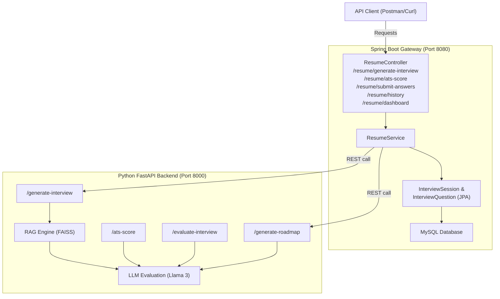

# Implementation Plan — Backend & AI Microservices (Complete)

This project is a pure **Backend and AI Microservice** platform. It integrates a secure Java Spring Boot application (user data, persistence, API gateway) with a Python FastAPI AI service (FAISS vector DB, Llama-3, semantic matching).

---

## Completed Architecture

---

## Completed Modules & Services

### 1. Spring Boot Gateway Backend (`careerprep/`)
- **Authentication & Security:** JWT validation via `JwtAuthFilter` protects all `/resume/**` endpoints, ensuring only logged-in users can access AI services.
- **Relational MySQL Schema:** JPA entities store `User`, `InterviewSession`, and `InterviewQuestion` data, maintaining detailed history.
- **API endpoints:**
  - `POST /auth/signup` & `POST /auth/login`
  - `POST /resume/generate-interview`: Returns generated questions and saves the session.
  - `POST /resume/ats-score`: Computes dynamic resume scores.
  - `POST /resume/submit-answers`: Submits answers for AI grading and updates the DB.
  - `GET /resume/history`: Retrieves past interview lists.
  - `GET /resume/dashboard`: Compiles statistics and fetches a personalized AI study roadmap.

### 2. Python FastAPI AI Microservice (`Rag/`)
- **RAG Engine (`rag_engine.py`):** Uses SentenceTransformers and FAISS vector database to inject candidate resume details into Llama-3 prompts for personalized interview questions.
- **ATS Scorer (`ats.py`):** Features dynamic skill extraction and job description matching without hardcoded values.
- **Evaluator (`evaluation.py`):** Standardizes mock interview grading in a single LLM call.
- **Learning Roadmap (`roadmap.py`):** Leverages Llama-3 to generate structured step-by-step milestones and recommended resources based on the user's weak points.
