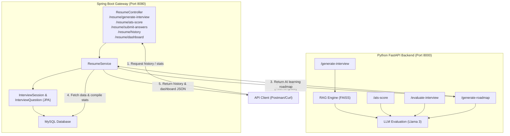

# CareerPrep — Integration Walkthrough

We have successfully integrated your **Spring Boot backend** with your **Python FastAPI AI backend** and expanded the project functionality to support profile history and AI-powered learning roadmaps.

---

## Architecture After Changes

---

## Completed Tasks & Code Highlights

### 1. User History & Dashboard (Spring Boot)
We added endpoints to track previous interviews and analyze user performance.

* **`GET /resume/history`**: Returns a list of all past `InterviewSession` records for the logged-in user in reverse chronological order.
* **`GET /resume/dashboard`**: Automatically calculates performance metrics across all user sessions:
  - `totalInterviews` taken.
  - `averageScore` out of 10.
  - `highestScore` achieved.
  - `weakTopicsList`: A list of all questions where the user scored `< 7` out of 10.
  - `aiRoadmap`: A personalized study guide generated dynamically by Llama-3 based on their weak topics.

### 2. AI Learning Roadmap Generator (Python FastAPI)
* [roadmap.py](file:///c:/Users/INAYATH/OneDrive/Desktop/careerprep/Rag/roadmap.py): Uses Llama-3 to analyze the user's weak topics and output a structured learning roadmap.
* **`POST /generate-roadmap`** (FastAPI): Exposed to handle roadmap requests. Returns JSON specifying:
  - **Phases**: Duration and topics to study.
  - **Learning Steps**: Concrete coding tasks and reading guides.
  - **Recommended Resources**: Documentation URLs (e.g. Oracle, MDN, Spring Guides).

### 3. Spring Boot Database Configuration
* [InterviewSessionRepository.java](file:///c:/Users/INAYATH/OneDrive/Desktop/careerprep/careerprep/src/main/java/com/aiplatform/careerprep/repository/InterviewSessionRepository.java): Added `findByUserOrderByCreatedAtDesc(User user)` to fetch history sorted by date.
* [ResumeController.java](file:///c:/Users/INAYATH/OneDrive/Desktop/careerprep/careerprep/src/main/java/com/aiplatform/careerprep/controller/ResumeController.java): Exposed the new GET history and dashboard endpoints with correct `List` imports.
* [ResumeService.java](file:///c:/Users/INAYATH/OneDrive/Desktop/careerprep/careerprep/src/main/java/com/aiplatform/careerprep/service/ResumeService.java): Added statistics aggregation, weak topic detection, and REST integration to forward topics to FastAPI `/generate-roadmap`.
* [pom.xml](file:///c:/Users/INAYATH/OneDrive/Desktop/careerprep/careerprep/pom.xml): Corrected Lombok dependencies and added Jackson databind configurations.
* [utils.py](file:///c:/Users/INAYATH/OneDrive/Desktop/careerprep/Rag/utils.py): Added robust `extract_json` parsing to prevent LLM responses from causing parse errors.
